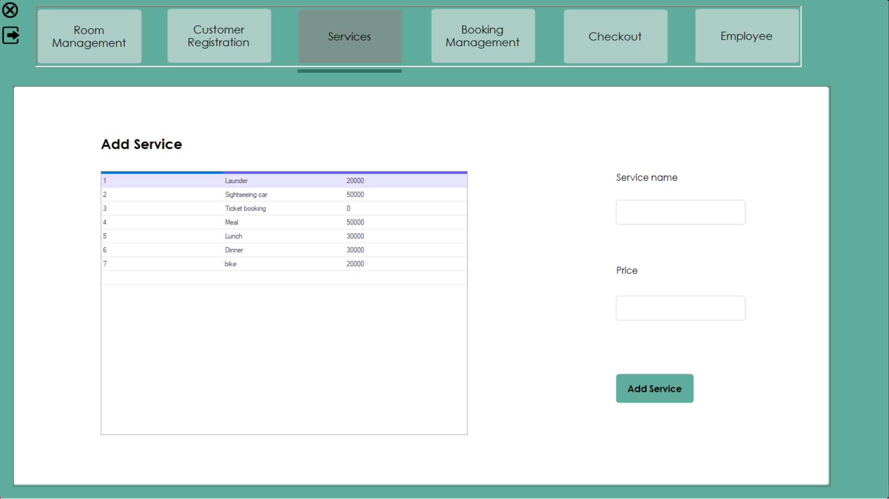

# Hotel Management System

## Description

A basic project about hotel management coded in C#

## Features

- Customer registration
- Room management
- Services management
- Booking management
- Checkout
- Employee management

## System interface

- Customer registration
  
- Room management
  
- Services management
  
  
- Booking management
  
  .png>)
- Checkout
  
- Employee management
  
  
  

## Demo video

https://drive.google.com/file/d/1Uf4jCNwesa80ArHIiQw4hxhbENcuPe9c/view?usp=sharing
